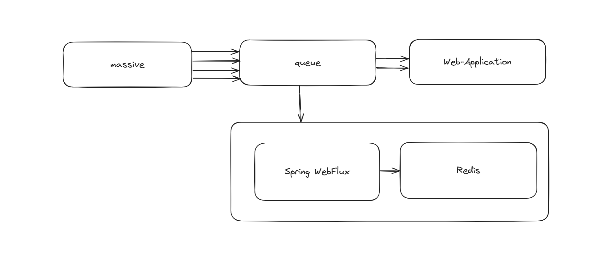
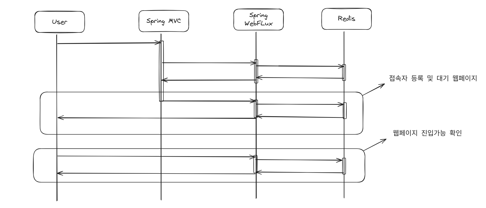

# Idol-Ticketing-Server
아이돌 티켓팅 접속자 대기열 시스템 서버 입니다.

## 시스템 아키텍처

접속자 대기열에서 redis를 사용한 이유 : 인메모리에 대한 성능뿐만 아니라 접속자를 관리할 큐로서 활용하기 위해서 인데 특히 WebFlux의 수평확장과 레디스를 통해 단위 큐로서 운영이 가능하기 때문이다.

- sorted Set를 사용해서 대기 큐를 구현 : 각각의 접속을 userId에 대해서 키로 관리할 것이고 value를 요청 시간으로 설정할 것이다. 이를 통해서 선착순 입장을 보장하기 위함이다.
- 스케줄러를 통해서 순차적으로 접속자를 접속 가능하게 할 것이다.

## 프로젝트 시퀀스

- 처음에 대기열을 통해서 사용자가 가득차게 되면 접속자 등록 및 대기 페이지로 전환
- 유저는 계속해서 웹페이지 진입 가능한지 확인

### 티켓팅, 수강신청

짧은 시간에 많은 트래픽이 몰리는 상황에 맞는 프로젝트이다. 만약 서버 단에서 이러한 짧은 시간에 많은 트래픽이 몰리게 되는 상황이 온다면 어떻게 대처해야 할까? 아무런 대처 없이 개발을 진행했다면 사용자는 페이지 조회도 불가능할 것이다. → 접속자 대기열을 만드는 것이 해결방법이다.

읽기 위주인지, 쓰기 위주인지에 따라 대처법이 다르다. → 어떻게 다르지..?

- 읽기 위주
    - 캐싱 계층 도입 : redis, memcached 등 인메모리 캐시를 활용해서 db 부하 최소화
    - CDN : 정적 리소스는 CDN을 사용해서 분산 처리
    - DB Replication : 읽기 전용 슬레이브 DB를 둬서 읽기 요청을 분산 시킨다.
    - 쿼리 최적화 및 인덱싱 : 읽기 성능을 극대화하기 위해서 쿼리 튜닝과 인덱싱으로 설계를 강화
- 쓰기 위주
    - 큐잉 시스템 도입 : kafka, rabbitmq 등 메시지 시스템을 도입하여 쓰기 요청에 대한 로직을 비동기적으로 처리하여 순간 트래픽을 완화
    - DB 샤딩 : 데이터베이스를 여러 샤드로 분산하여  쓰기를 분산한다.
    - Batch Writing/Buffering : 쓰기 요청을 모아서 일괄 처리하거나 버퍼링을 통해서 주기적으로 처리
    - Lock/Transaction 관리 : 동시성 제어를 위한 락 전략, 트랜잭션 분리 수준 등으로 데이터 정합성을 확보한다.

---

## 접속자 대기열 시스템

1. 예측 가능한 시기
2. 짧은 시간동안 대량의 트래픽이 인입되는 상황
3. 특정 웹페이지에 대해 사용자 진입 수 제한
4. 대기 사용자에 대해 순차적으로 진입

위의 기능들이 적용될 프로젝트이다.
